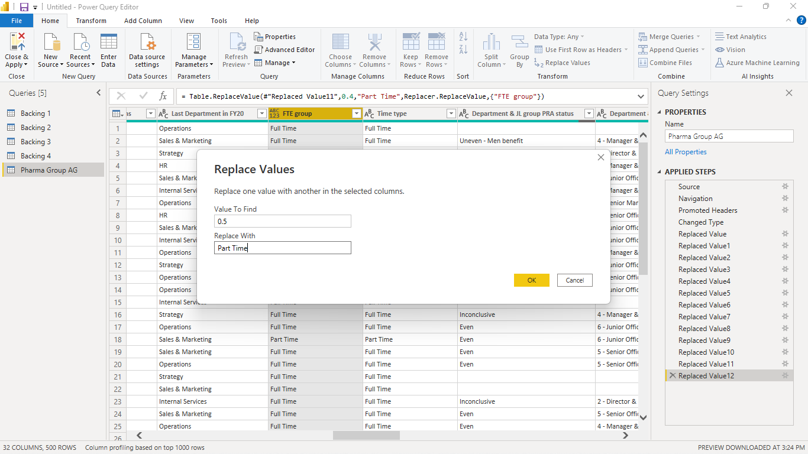
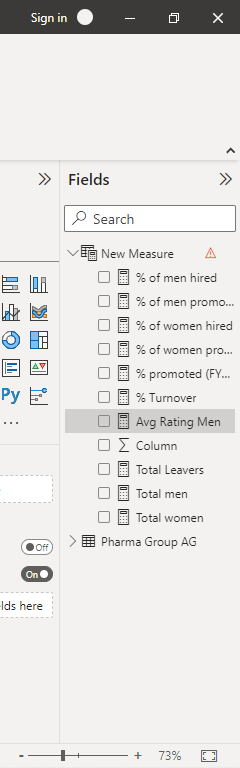
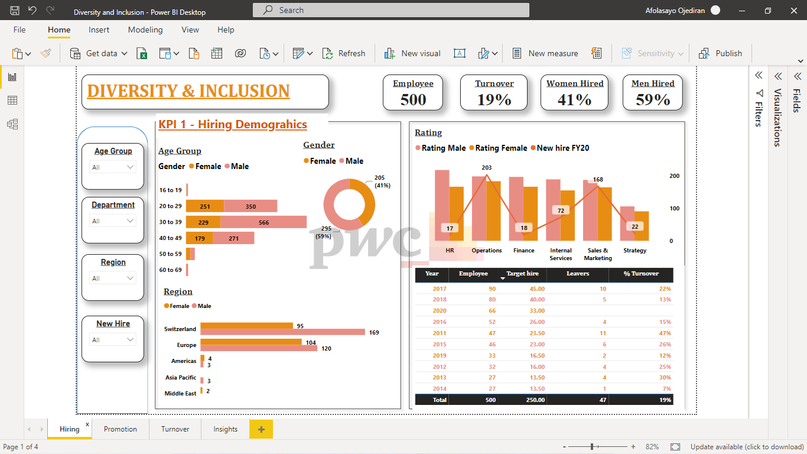
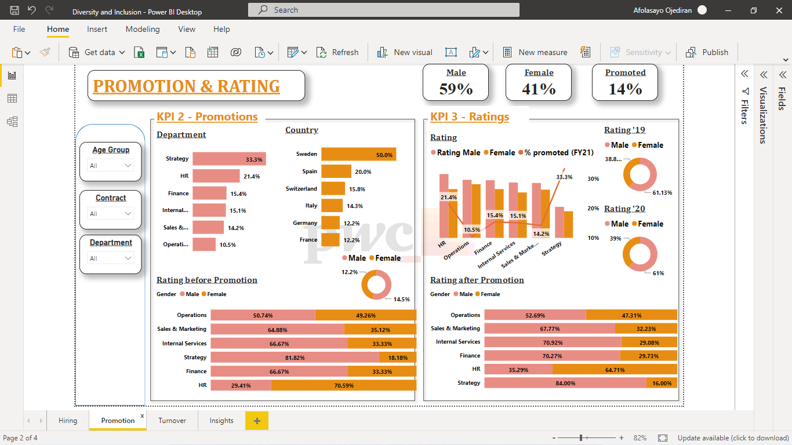

# Diversity-and-Inclusion-Analysis

## INTRODUCTION
---

Diversity refers to the differences that exist among individuals, including but not limited to race, ethnicity, gender, age, sexual orientation, religion, and socioeconomic status. Inclusion, on the other hand, refers to creating an environment where everyone feels valued and respected, regardless of their differences.

## PROBLEM STATEMENT

Human Resources at PhoneNow client is highly into diversity and inclusion. They’ve been working hard to improve gender balance at the executive management level, but they’re not seeing any progress.

## Skills Demonstarted

- DAX
- Power Query
- Tooltips
- Filters
- Buttons
- New Measures

## METHODOLOGY

1.  Data Collection: The first step in the process is to collect relevant data on hiring and promotion practices in the organization. This may involve gathering information on the race, gender, age, and other demographic characteristics of job applicants and employees. As this task is in continuation of my Internship with PwC Switzerland, the dataset was provided by the organization.

2. Data Cleaning and Preparation: Once the data has been collected, it needs to be cleaned and prepared for analysis. This includes; removing duplicate entries, correcting errors, replacing nulls with 0, changing data types, fixing decimals, re-naming headers, and formatting the data to ensure it can be easily analyzed in Power Query.

3. New Measures I created the following New Measures using the DAX formula.

- Total  Attrition =  CALCULATE(COUNTA('HR Manager'[Employee ID]), 'HR Manager'[Leaver FY] IN { "FY20" })

- Total men =  Calculate(distinctcount('HR Manager'[Employee ID]),Filter('HR Manager','HR Manager'[Gender]="Male"))

- Total of women =  Calculate(distinctcount('HR Manager'[Employee ID]),Filter('HR Manager','HR Manager'[Gender]="Female"))

- % employees promoted (FY21) = Divide(Calculate(distinctcount('HR Manager'[Employee ID]),Filter('HR Manager','HR Manager'[Promotion in FY21?]="Yes")),Calculate(distinctcount('HR Manager'[Employee ID]),Filter('HR Manager','HR Manager'[In base group for Promotion FY21]="Yes")))

- % of hires men = Divide('HR Manager'[# of men],('HR Manager'[# of men]+'HR Manager'[# of women]))

- % of hires women =  Divide('HR Manager'[# of women],('HR Manager'[# of women]+'HR Manager'[# of men]))

- % Men Promoted = Divide(Calculate(distinctcount('HR Manager'[Employee ID]),Filter('HR Manager','HR Manager'[Gender]="Male")),distinctcount('HR Manager'[Employee ID]))

- % Women Promoted = Divide(Calculate(distinctcount('HR Manager'[Employee ID]),Filter('HR Manager','HR Manager'[Gender]="Female")),distinctcount('HR Manager'[Employee ID]))

- % Turnover = Divide(Calculate(distinctcount('HR Manager'[Employee ID]),Filter('HR Manager','HR Manager'[FY20 leaver?]="Yes")),Divide(Calculate(distinctcount('HR Manager'[Employee ID]),Filter('HR Manager','HR Manager'[In base group for turnover FY20]="Y"))+Calculate(distinctcount('HR Manager'[Employee ID]),Filter('HR Manager',NOT('HR Manager'[Department @01.07.2020]=BLANK()))),2))

- Avg Rating Men = Calculate(Average('HR Manager'[FY20 Performance Rating]),Filter('HR Manager','HR Manager'[Gender]="Male"))

- Avg Rating Women = Calculate(Average('HR Manager'[FY20 Performance Rating]),Filter('HR Manager','HR Manager'[Gender]="Female"))

## VISUALIZATION

1. Diversity and Bias

2. Retention/Promotion

3. Performance Rating

4. Attrition & Turnover
.png)

## CONCLUSION

- 41% hire are female
- 59% hire are male
- 14% were promoted
- More male were promoted
- Most employees are from Switzerland

## RECOMENDATION

- Increase transparency
- Review hiring and promotion processes
- Provide training
- Foster an inclusive culture
- Track progress

You can further interact with the dashboard [here](https://app.powerbi.com/groups/me/reports/019f95fd-9207-40f1-9143-ef57e1731636/ReportSectionda4f35a7627944a057aa)
